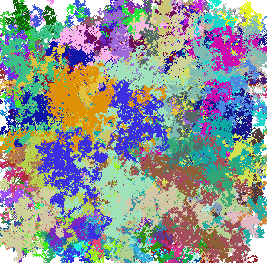

# Random Walk Art

My first artistic project created in 2019.
A simple random walk simulation using Python and Pygame. The program simulates a point moving randomly on a 2D grid, leaving a colorful trail behind.

## Features

- **Random Movement**: The point moves randomly in small steps, simulating a Brownian motion effect.
- **Color Variation**: The point changes color when it resets to the center.
- **Boundary Handling**: When the point moves outside the screen, it is repositioned at the center with a new random color.
- **Minimalist Design**: A simple, lightweight implementation for visualization.

## Requirements

- **Python 3.x**
- **Pygame**: Install it via pip with `pip install pygame`

## Project Structure

- **`main.py`**: The main script running the random walk simulation.
- **Random Walk Mechanism**: The point moves in a random direction at each step.
- **Boundary Reset**: If the point reaches the edge of the screen, it resets to the center with a new color.

## Customization

You can modify various parameters within the script:

- **Resolution** (`resolution`)
- **Step Size** (currently random movement by `-1` to `1` in both x and y directions)
- **Starting Position** (`resolution[0]/2`, `resolution[1]/2`)
- **Color Randomization**

## Simulation Details

- **The Method**: The point moves randomly in small steps (`-1`, `0`, or `1`) at each iteration.
- **Boundary Handling**: If the point reaches the screen edge, it resets to the center with a new color.
- **Visual Effect**: A colorful path is created as the point moves, forming a unique pattern over time.

## License

This project is licensed under the Mozilla Public License 2.0 (MPL-2.0).

### Additional Note on Commercial Use
**Commercial use of this software or any derived works is prohibited without prior written permission from the original author.** For commercial licensing inquiries, please contact loan.tremoulet.breton@gmail.com.

